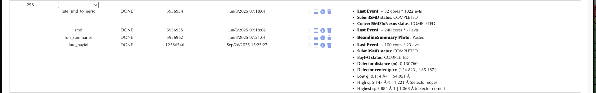

# BayFAI User Documentation

<a name="toc"></a> **Jump to:**
- [`Running BayFAI Benchmark`](#running-bayfai-benchmark)
- [`Setting up BayFAI Manual Calibration notebook`](#setting-up-bayfai-notebook)
- [`BayFAI Experiment Configuration`](#bayfai-configuration)
- [`Running BayFAI Benchmark`](#running-bayfai-benchmark)
- [`Running BayFAI from the Command-Line`](#running-bayfai-from-the-command-line)
- [`Running BayFAI from the eLog`](#running-bayfai-from-the-elog)
- [`Running only BayFAI Geometry Calibration`](#running-only-bayfai-geometry-calibration)

---
## Running BayFAI Benchmark 

## Setting up BayFAI Notebook

If BayFAI failed to produce a clean geometry, this repository provides a notebook in `notebooks/manual_calibration.ipynb` for refinement.
To set it up, follow these steps:

1. Clone this repository in the experiment results folder:
    ```bash
    (base) [lconreux@sdfiana002 ~] cd /sdf/data/lcls/ds/<hutch>/<experiment>/results/
    (base) [lconreux@sdfiana002 results] git clone https://github.com/lcls-mlcv/BayFAI.git
    ```

2. Build the package:
    ```bash
    (base) [lconreux@sdfiana002 results] cd BayFAI
    (base) [lconreux@sdfiana002 BayFAI] pip install -e .
    ```

3. Open an Ondemand session to open the jupyter notebook now!
    
4. To get started, you need to specify a few things for setting up the calibration:
    - experiment tag
    - run number
    - detector name (jungfrau, epix10k2M...)
    - calibrant name (AgBh, LaB6, CeO2...)
    - powder_path (path to the hdf5 produced by `smalldata`)

5. Once the setup cell is run, iterate over changing:
    - Image settings
        - vmin
        - vmax
        - 1st ring to be plotted
        - last ring to be plotted
    - Geometric Parameters
        - detector-sample distance dist
        - shift in y-axis poni1
        - shift in x-axis poni2
        - rotation around y-axis rot1
        - rotation around x-axis rot2
        - rotation around z-axis rot3

6. Once you are happy with the base geometry, you can:
    - Azimuthally integrate the detector to check for alignment by calling `fitter.integrate_detector()`
    - Further refine the geometry using PyFAI gradient descent by calling `fitter.refine_geometry()`
    - Iterate again if needed.

7. Once everything is perfect, output the corrected geometry files by running the last cell

## BayFAI Configuration

### Preliminaries `lute`

BayFAI is run within the newer version of `btx`, `lute` standing for LCLS Unified Task Executor. `lute` is still in development, so changes can be expected.

A stable and up to date `lute` version with BayFAI can be found at [lute](https://github.com/slac-lcls/lute).
On S3DF, a local `lute` clone can be found at `/sdf/group/lcls/ds/tools/lute/dev/lute`. 
A development and test `BayFAI` version can be found in this repository under `BayFAI` directory. 
On S3DF, a local `BayFAI` clone can be found at `/sdf/data/lcls/ds/prj/prjlute22/results/benchmarks/geom_opt/BayFAI`.

### Preliminaries `smalldata`

BayFAI needs a powder image to perform the calibration. `smalldata` does it for us.
A stable and up to date version working with BayFAI can be found at [smalldata](https://github.com/slac-lcls/smalldata_tools).
No need to setup `smalldata`, either `lute` or the operator will generally do it for us.

### Experiment Configuration

Once the experiment is ready to collect a geometry calibration run, and the user wants to run BayFAI, the first step is to setup `lute`.

1. Run the `setup_lute` command:

    TW: this script requires the user to have an active kerberos authentification ticket to be able to populate the eLog. You can check if you have an active ticket by running `klist` in your terminal.
    If you don't have one, before running `setup_lute`, run `kinit` in your terminal and give your unix password.
    ```bash
    (base) [lconreux@sdfiana002 ~] /sdf/group/lcls/ds/tools/lute/dev/lute/utilities/setup_lute -e <experiment> -f --directory=bayfai -W bayfai --test --nodes=1
    ```
    ___Nota Bene___: The script will prompt you three times (for partition, account, and number of tasks). Simply press Enter each time to accept the default settings.

3. Navigate to the lute working directory and create useful folders:
    ```bash
    (base) [lconreux@sdfiana002 ~] cd /sdf/data/lcls/ds/<hutch>/<experiment>/results/bayfai/
    (base) [lconreux@sdfiana002 bayfai] mkdir smd_output
    ```
    In this directory, you should see a fresh install of `lute` as well as the working directory for the current experiment `lute_output`.
    We create a `smd_ouput` folder where the summed powder image will be stored to not overwrite the experiment data in the `hdf5` experiment folder.

4. Modify the template config yaml:
    Inside the `lute_output`, you should see a template yaml file with the hutch tag as a prefix.
    ```bash
    (base) [lconreux@sdfiana002 bayfai] nano/vim lute_output/<hutch>_lute.yaml
    ```
    
    A `lute` config template is divided into several _documents_, the `lute_config` which configures basic experiment information (top top of the yaml), then comes task-specific parameters.
    1. `lute_config`:
       - If launched from eLog, erase the experiment and run lines.
    2. Scroll down until you find `SubmitSMD`:
       - Fill in the `detnames` section with the name of detector that was used for that run.

          `detnames: ["jungfrau"]`
       - Fill in the output `directory` where the hdf5 file will be stored. By default, it will be outputted inside the `hdf5` experiment folder, but we do not want to overwrite stuff in that folder.

          `directory: /sdf/data/lcls/ds/<hutch>/<experiment>/results/bayfai/smd_output/`
    3. Scroll down all the way to `BayFAI`:
       - Fill in a `center` initial guess geometry, BayFAI will scan around that geometry.
       - Fill in the `calibrant` name (usually AgBh or LaB6) (list of all calibrant available: [ressources](https://github.com/silx-kit/pyFAI/tree/main/src/pyFAI/resources/calibration)).
       - Fill in the `detname`, as it is defined in the psana environment (epix10k2M, jungfrau4M, jungfrau, Epix10kaQuad0, etc...).

            ```
            BayFAI:
                fixed:
                - "rot1"
                - "rot2"
                - "rot3"
                center:
                  dist: 0.1                 # Fill this section with rough estimates
                  poni1: 0.0
                  poni2: 0.0
                  rot1: 0.0
                  rot2: 0.0
                  rot3: 0.0
                calibrant: "AgBh"           # Fill this line with calibrant name (AgBh, LaB6...)
                detname: "jungfrau"         # Fill this line with detector name (epix10k2M, jungfrau...)
            ```

## Running BayFAI benchmark

Calibration runs were collected to constitute a benchmark to test different versions of BayFAI. Those calibration powder images can be found under the `benchmark` folder in this repository.

If you would like to run the whole benchmark test, follow these steps:

1. Clone the BayFAI repository
    ```bash
    (base) [lconreux@sdfiana002 ~] git clone https://github.com/lcls-mlcv/BayFAI.git
    ```

2. Navigate to the launchpad folder:
    ```bash
    (base) [lconreux@sdfiana002 ~] mkdir launchpad 
    (base) [lconreux@sdfiana002 launchpad] cd launchpad 
    ```

3. Run the hutch benchmark of your choice:
    ```bash
    (base) [lconreux@sdfiana002 launchpad] python ../BayFAI/scripts/run_benchmark.py --hutch=<hutch> (cxi, mec, mfx_psana1, mfx_psana2)
    ```

__Nota Bene__
- This will create a `results` folder in your working directory with inside the final optimization plots under `figs` as well as the geometry found in `geom`.
- The `lute` logs can be found in your `launchpad` folder. Here, the default BayFAI development `lute` is used to run the benchmark. This `lute` clone can be found at `/sdf/data/lcls/ds/prj/prjlute22/results/geom_opt/lute`.
- You are welcome to try different set of hyperparameters by adding extra keys to the command (`--n_samples`, `--n_iterations`, `--max_rings`...)


## Running BayFAI from the Command-Line

Skip this section if you are only interested in launching BayFAI from the [eLog](#running-bayfai-from-the-elog)

After setting correctly the config yaml, one can launch BayFAI workflow from the command-line by calling the lute executor.

1. Navigate to the launchpad folder:
    ```bash
    (base) [lconreux@sdfiana002 bayfai] mkdir launchpad 
    (base) [lconreux@sdfiana002 bayfai] cd launchpad 
    ```

2. Double-check if the distance, the calibrant, or the detector have been changed in between runs!
    ```bash
    (base) [lconreux@sdfiana002 launchpad] nano ../lute_output/<hutch>_lute.yaml
    ```

3. Launch BayFAI workflow
    ```bash
    (base) [lconreux@sdfiana002 launchpad] /sdf/data/lcls/ds/<hutch>/<experiment>/results/bayfai/lute/launch_scripts/submit_launch_airflow.sh /sdf/data/lcls/ds/<hutch>/<experiment>/results/bayfai/lute/launch_scripts/launch_airflow.py -w bayfai     -c /sdf/data/lcls/ds/<hutch>/<experiment>/results/bayfai//lute_output/<hutch>_lute.yaml --partition=milano --account=lcls:<experiment> --ntasks=101 --nodes=1 --test
    ```
    This will launch the BayFAI workflow using the config yaml one specified earlier, and will scan 100 distances around the provided guess _dist_.

4. Monitor the Results (after a couple of minutes):
   - Inside the launchpad folder, one will find the logs. If everything went smooth, you should see Task Complete at the bottom of it along with the geometry!
   - Inside the smd_output, one will find the powder computed thanks to `SubmitSMD`.
   - After task completion, a `figs` folder should be created inside the working directory. Inside of it, Fitting plots along with BayFAI metrics can be found.
   - The calibrated geometry files should created within the `geom` also inside the working directory:
   ```bash
   (base) [lconreux@sdfiana002 launchpad] cd ../lute_output/geom
   (base) [lconreux@sdfiana002 geom] ll
   -rw-rw----+ 1 lconreux ps-users  2729 Dec  9 19:13 <run>-end.data
   -rw-rw----+ 1 lconreux ps-users 18365 Dec  9 19:13 r<run:0>4>.geom
   -rw-rw----+ 1 lconreux ps-users 18365 Dec  9 19:13 r<run:0>4>.poni
   ```

## Running BayFAI from the eLog

1. After calling `setup_lute`, all the necessary fields to define the geometry calibration workflow should be already populated.
On the eLog, check if a `lute_bayfai` workflow exists by going to __Workflow__ > __Definition__

|  | 
|:-------------------------------------------------------------------------:| 
|       __BayFAI workflow definition from the eLog for mfx100852324__       |

2. Double-check if the distance, the calibrant, or the detector have been changed in between runs!
    ```bash
    (base) [lconreux@sdfiana002 bayfai] nano lute_output/<hutch>_lute.yaml
    ```

3. Go to __Workflow__ > __Control__ to trigger BayFAI for the desired run!

4. Monitor the Results (after a couple of minutes!):
   - When the jobs are done, the geometry as well as the resolution coverage will be reported on the eLog!
   - You can inspect the fit from the eLog by going to __Summaries__ > __Geometry_Fit__ > __r0000__ > __detname__
   - Inside the smd_output, one will find the powder computed thanks to `SubmitSMD`.
   - After task completion, a `figs` folder should be created inside the working directory. Inside of it, Fitting plots along with BayFAI metrics can be found.
   - The calibrated geometry files should created within the `geom` also inside the working directory:
   ```bash
   (base) [lconreux@sdfiana002 bayfai] cd lute_output/geom
   (base) [lconreux@sdfiana002 geom] ll
   -rw-rw----+ 1 lconreux ps-users  2729 Dec  9 19:13 <run>-end.data
   -rw-rw----+ 1 lconreux ps-users 18365 Dec  9 19:13 r<run:0>4>.geom
   -rw-rw----+ 1 lconreux ps-users 18365 Dec  9 19:13 r<run:0>4>.poni
   ```

|  | 
|:------------------------------------------------------------------------------:| 
|       __BayFAI reporting of geometry from AgBh for mfx100852324 run 298.__       |


|  | 
|:-------------------------------------------------------------------------------:| 
|    __BayFAI summary of geometry inferred from AgBh for mfx100852324 run 298.__    |

## Running only BayFAI Geometry Calibration

This is for advanced usage.
If one has already a powder image to be used for calibration, the `smalldata` step can be skipped to directly run the geometry calibration step.

WORK IN PROGRESS
---
