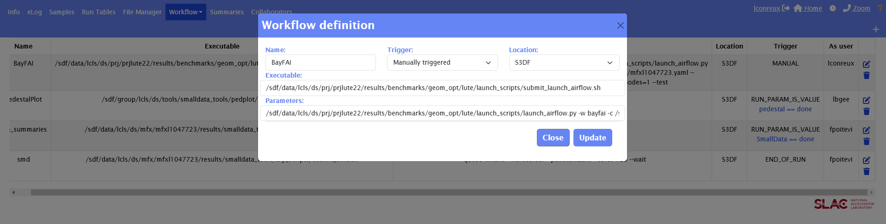
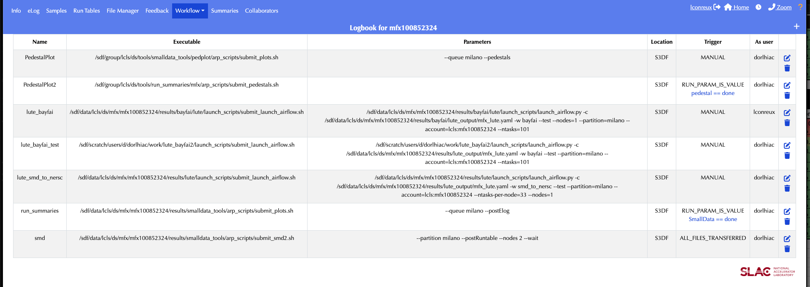
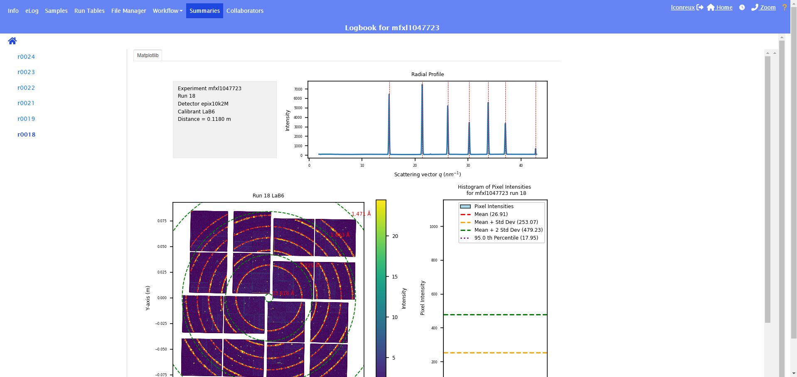

# BayFAI User Documentation

<a name="toc"></a> **Jump to:**
- [`BayFAI Configuration`](#bayfai-configuration)
- [`Running BayFAI from the Command-Line`](#running-bayfai-from-the-command-line)
- [`Running BayFAI from the eLog`](#running-bayfai-from-the-elog)
- [`Running only BayFAI Geometry Calibration`](#running-only-bayfai-geometry-calibration)

---
## BayFAI Configuration

### Preliminaries `lute`

BayFAI is run within the newer version of `btx`, `lute` standing for LCLS Unified Task Executor. This next iteration of `btx` is still in development.
Due to its recent implement, BayFAI has not yet been merged in the main branch of `lute`.

A stable and up to date version with BayFAI can be found at [lute](https://github.com/LouConreux/lute).

### Preliminaries `smalldata`

BayFAI needs a powder image to perform the calibration. `smalldata` does it for us.
A stable and up to date version working with BayFAI can be found at [smalldata](https://github.com/slac-lcls/smalldata_tools).

### Experiment Configuration

Each experiment requires a customized YAML configuration file.

1. Navigate to the experiment scratch folder and create a working directory:
    ```bash
    (base) [lconreux@sdfiana002 ~] cd /sdf/data/lcls/ds/<hutch>/<experiment>/scratch/
    (base) [lconreux@sdfiana002 scratch] mkdir bayfai
    ```

2. Navigate to the lute working directory and create useful subfolders:
    ```bash
    (base) [lconreux@sdfiana002 scratch] cd bayfai
    (base) [lconreux@sdfiana002 bayfai] mkdir yamls
    (base) [lconreux@sdfiana002 bayfai] mkdir launchpad
    (base) [lconreux@sdfiana002 bayfai] mkdir smd_output
    ```

3. Clone the BayFAI lute repository:
   ```bash
    (base) [lconreux@sdfiana002 bayfai] git clone https://github.com/LouConreux/lute.git
    ```

4. Set up Permissions:
   ```bash
    (base) [lconreux@sdfiana002 bayfai] chmod -R a+rx /sdf/data/lcls/ds/mfx/mfxl1047723/scratch/bayfai
    ```
   
5. Fetch a config yaml:
    A template config yaml can be found at : `/sdf/data/lcls/ds/prj/prjlute22/results/benchmarks/yamls/config.yaml`.
    Copy this config yaml to the scratch folder with appropriate experiment tag:
    ```bash
    (base) [lconreux@sdfiana002 bayfai] cp /sdf/data/lcls/ds/prj/prjlute22/results/benchmarks/yamls/config.yaml yamls/<experiment>.yaml
    ```
    At this point, the working directory should look like this: 
    ```bash
    (base) [lconreux@sdfiana002 bayfai]$ tree
    .
    ├── launchpad
    ├── lute
    │   └── lute repository with BayFAI
    ├── smd_output
    └── yamls
        └── <experiment>.yaml
    ```

4. Fill in the blanks in the config yaml:
    A template config yaml has been created but the user needs to fill in some important information.
    ```bash
    (base) [lconreux@sdfiana002 bayfai] nano yamls/<experiment>.yaml
    ```
    Here what the template config file looks like:
    ```bash
    date: 2023/10/25
    lute_version: 0.1
    experiment: <experiment> # If launch from eLog, erase that line
    run: <run>               # If launch from eLog, erase that line
    task_timeout: 1200
    title: LUTE Task Configuration
    work_dir: /sdf/data/lcls/ds/<hutch>/<experiment>/scratch/bayfai/ # Fill this line 
    ---
    OptimizePyFAIGeometry:
    bo_params:
        bounds:
        dist: <guess distance> # Fill this line with guessed detector distance
        poni1:
        - -0.01
        - 0.01
        poni2:
        - -0.01
        - 0.01
        res: 0.0002         
    calibrant: <calibrant> # Fill this line with calibrant name (AgBh, LaB6...)
    det_type: <detector>   # Fill this line with detector name (epix10k2M, jungfrau4M, Rayonix...)
    SubmitSMD:
    detSumAlgos:
        Rayonix:
        - calib_skipFirst_thresADU1
        - calib_skipFirst_max
        all:
        - calib
        - calib_dropped
        - calib_dropped_square
        - calib_thresADU1
        epix10k2M:
        - calib_thresADU5
        - calib_max
        jungfrau4M:
        - calib_thresADU5
        - calib_max
    detnames:
    - <detector> # Fill this line with detector name (epix10k2M, jungfrau4M, Rayonix...)
    directory: /sdf/data/lcls/ds/<hutch>/<experiment>/scratch/bayfai/smd_output/ # Fill this line 
    #producer: /sdf/data/lcls/ds/<hutch>/<experiment>/results/smalldata_tools/lcls1_producers/smd_producer.py # Uncomment that line if SMD already set up in results and comment the next one
    producer: /sdf/data/lcls/ds/<hutch>/<experiment>/scratch/bayfai/smalldata_tools/lcls1_producers/smd_producer.py # lute will clone SMD at working directory if no SMD found
    ...
    ```
    BayFAI's config template is divided into three parts, the `lute_config`: basic experiment configuration (top top of the yaml), `OptimizePyFAIGeometry`: BayFAI required parameters, `SMDSubmit`: smalldata required parameters
    1. `lute_config`:
      - If launched from eLog, erase the experiment and run lines.
      - Fill in the correct working directory `/sdf/data/lcls/ds/<hutch>/<experiment>/scratch/bayfai/`.
    2. `OptimizePyFAIGeometry`:
      - Fill in a guessed detector distance, BayFAI will scan around that distance in the following manner [guess-50mm; guess+50mm] with a step size of 1mm.
      - Fill in the calibrant name, (usually AgBh or LaB6) (list of all calibrant available: [ressources](https://github.com/silx-kit/pyFAI/tree/main/src/pyFAI/resources/calibration)).
      - Fill in the detector type name, as it is defined in the psana environment (epix10k2M, jungfrau4M, Rayonix, Epix10kaQuad...).
    3. `SubmitSMD`:
      - Fill the output directory for smalldata.
      - Fill out the smalldata producer python file path. If you don't have smalldata set up for your experiment, no worries, lute will clone it for you!

## Running BayFAI from the Command-Line

Skip this section if you are only interested in launching BayFAI from the [eLog](#running-bayfai-from-the-elog)

After setting correctly the config yaml, one can launch BayFAI workflow from the command-line by calling the lute executor.

1. Navigate to the launchpad folder:
    ```bash
    (base) [lconreux@sdfiana002 bayfai] cd launchpad 
    ```

2. Double-check if the distance, the calibrant, or the detector have been changed in between runs!
    - Modify the config yaml accordingly!
    ```bash
    (base) [lconreux@sdfiana002 launchpad] nano ../yamls/<experiment>.yaml
    ```

3. Launch BayFAI workflow
    ```bash
    (base) [lconreux@sdfiana002 launchpad] /sdf/data/lcls/ds/<hutch>/<experiment>/scratch/bayfai/lute/launch_scripts/submit_launch_airflow.sh /sdf/data/lcls/ds/<hutch>/<experiment>/scratch/bayfai/lute/launch_scripts/launch_airflow.py -w bayfai -c /sdf/data/lcls/ds/<hutch>/<experiment>/scratch/bayfai/yamls/<experiment>.yaml --partition=milano --ntasks=102 --account=lcls:<experiment> --nodes=1 --test
    ```
    This will launch the BayFAI workflow using the config yaml one specified earlier, and will scan 101 distances around the provided <guess distance>.

4. Monitor the Results (after a couple of minutes):
    - Inside the launchpad folder, one will find the logs. If everything went smoothed, one should see Task Complete at the bottom of it along with the geometry!
    - Inside the smd_output, one will find the powder computed thanks to `smalldata`.
    - After task completion, a figs folder should be created. Inside of it, Fitting plots along with BayFAI metrics can be found.
    - The corrected geometry files should created within the calibration folder of the experiment: 
    ```bash
    (base) [lconreux@sdfiana002 launchpad] cd /sdf/data/lcls/ds/<hutch>/<experiment>/calib/<group>/<source>/geometry/
    (base) [lconreux@sdfiana002 geometry] ls -l
    -rw-rw-r--+ 1 lbgee    ps-users  3267 Dec  9 15:28 0-end.data
    -rw-rw----+ 1 lconreux ps-users  2729 Dec  9 19:13 <run>-end.data
    -rw-rw-r--+ 1 lbgee    ps-users   257 Dec  9 15:28 HISTORY
    -rw-rw----+ 1 lconreux ps-users 18365 Dec  9 19:13 r<run:0>4>.geom
    ```

    At this point, the working directory should look like this:
    ```bash
    (base) [lconreux@sdfiana002 bayfai]$ tree
    .
    ├── figs
    │    └── bayFAI_<experiment>_r<run:0>4>.png
    ├── launchpad
    │   └── slurm-<job-id>.out
    ├── lute
    │   └── lute repository with BayFAI
    ├── lute.db # lute database created to communicate between SmallData Task and BayFAI
    ├── smd_output
    │   └── <experiment>_Run<run:0>4>.h5
    └── yamls
        └── <experiment>.yaml
    ```

## Running BayFAI from the eLog

1. Go to the Workflow Definition Panel:
    - Click on Add a Workflow
    - Fill in the Workflow Definition informations:
        - Name: BayFAI
        - Trigger: Manually triggered
        - Location: S3DF
        - Executable: /sdf/data/lcls/ds/hutch/experiment/scratch/bayfai/lute/launch_scripts/submit_launch_airflow.sh
        - Parameters: /sdf/data/lcls/ds/hutch/experiment/scratch/bayfai/lute/launch_scripts/launch_airflow.py -w bayfai -c /sdf/data/lcls/ds/hutch/experiment/scratch/bayfai/yamls/<experiment>.yaml --partition=milano --ntasks=102 --account=lcls:experiment --nodes=1 --test

|  | 
|:------------------------------------------------------------------------:| 
|     __BayFAI workflow configuration from the eLog for mfxl1047723.__     |

At this point, this is what the Workflow Definition Panel should look like:

|  | 
|:-------------------------------------------------------------------------:| 
|       __BayFAI workflow definition from the eLog for mfxl1047723.__       |

2. Double-check if the distance, the calibrant, or the detector have been changed in between runs!
    - Modify the config yaml accordingly!
    ```bash
    (base) [lconreux@sdfiana002 bayfai] nano yamls/<experiment>.yaml
    ```

3. Go to the Workflow Control Panel:
    - Trigger BayFAI for the desired run!

4. Monitor the Results (after a couple of minutes!):
    - Geometry is posted to the eLog along with the Resolution range covered by the detector (beam center is defined relative to the center of the powder image (in pixels)).
    - Fitting plots along with BayFAI metrics can be found in the "Summaries" page (go to ***Geometry_Fit > r0018*** where 18 is the run number).
    - The corrected geometry files should created within the calibration folder of the experiment:
    ```bash
    (base) [lconreux@sdfiana002 bayfai] cd /sdf/data/lcls/ds/<hutch>/<experiment>/calib/<group>/<source>/geometry/
    (base) [lconreux@sdfiana002 geometry] ls -l
    -rw-rw-r--+ 1 lbgee    ps-users  3267 Dec  9 15:28 0-end.data
    -rw-rw----+ 1 lconreux ps-users  2729 Dec  9 19:13 <run>-end.data
    -rw-rw-r--+ 1 lbgee    ps-users   257 Dec  9 15:28 HISTORY
    -rw-rw----+ 1 lconreux ps-users 18365 Dec  9 19:13 r<run:0>4>.geom
    ```

|  | 
|:------------------------------------------------------------------------------:| 
|       __BayFAI reporting of geometry from LaB6 for mfxl1047723 run 18.__       |


|  | 
|:-------------------------------------------------------------------------------:| 
|    __BayFAI summary of geometry inferred from LaB6 for mfxl1047723 run 18.__    |


If you are interested, at this point, the working directory should look like this:
```bash
(base) [lconreux@sdfiana002 bayfai]$ tree
.
├── launchpad
├── smd_output
│   └── <experiment>_Run<run:0>4>.h5
├── figs
│    └── bayFAI_<experiment>_r<run:0>4>.png
├── lute.db
└── yamls
    └── <experiment>.yaml
```
The powder image used is stored as h5 file inside smd_output, and the fitting summary seen on the eLog is stored under the figs folder.

## Running only BayFAI Geometry Calibration

This is for advanced usage.
If one has already a powder image to be used for calibration, the `smalldata` step can be skipped to directly run the geometry calibration step.

WORK IN PROGRESS
---
