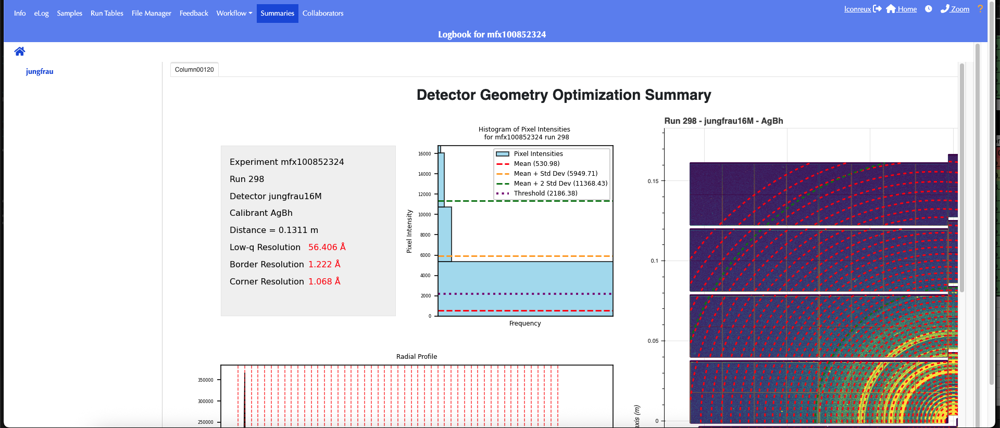

# BayFAI User Documentation

<a name="toc"></a> **Jump to:**
- [`BayFAI Experiment Configuration`](#bayfai-configuration)
- [`Running BayFAI from the Command-Line`](#running-bayfai-from-the-command-line)
- [`Running BayFAI from the eLog`](#running-bayfai-from-the-elog)
- [`Running only BayFAI Geometry Calibration`](#running-only-bayfai-geometry-calibration)
- [`Running BayFAI test version`](#running-bayfai-test-version)

---
## BayFAI Configuration

### Preliminaries `lute`

BayFAI is run within the newer version of `btx`, `lute` standing for LCLS Unified Task Executor. `lute` is still in development, so changes can be expected.

A stable and up to date `lute` version with BayFAI can be found at [lute](https://github.com/slac-lcls/lute).
On S3DF, a local `lute` clone can be found at `/sdf/group/lcls/ds/tools/lute/dev/lute`. 
A development and test `BayFAI` version can be found in this repository under `BayFAI` directory. 
On S3DF, a local `BayFAI` clone can be found at `/sdf/data/lcls/ds/prj/prjlute22/results/benchmarks/geom_opt/BayFAI`.

### Preliminaries `smalldata`

BayFAI needs a powder image to perform the calibration. `smalldata` does it for us.
A stable and up to date version working with BayFAI can be found at [smalldata](https://github.com/slac-lcls/smalldata_tools).
No need to setup `smalldata`, either `lute` or the operator will generally do it for us.

### Experiment Configuration

Once the experiment is ready to collect a geometry calibration run, and the user wants to run BayFAI, the first step is to setup `lute`.

1. Run the `setup_lute` command:
   TW: this script requires the user to have an active kerberos authentification ticket to be able to populate the eLog. You can check if you have an active ticket by running `klist` in your terminal.
    If you don't have one, before running `setup_lute`, run `kinit` in your terminal and give your unix password.
    ```bash
    (base) [lconreux@sdfiana002 ~] /sdf/group/lcls/ds/tools/lute/dev/lute/utilities/setup_lute -e <experiment> -f --directory bayfai -w bayfai --test --nodes=1
    ```
    ___Nota Bene___: The script will prompt you three times (for partition, account, and number of tasks). Simply press Enter each time to accept the default settings.

2. Navigate to the lute working directory and create useful folders:
    ```bash
    (base) [lconreux@sdfiana002 ~] cd /sdf/data/lcls/ds/<hutch>/<experiment>/results/bayfai/
    (base) [lconreux@sdfiana002 bayfai] mkdir smd_output
    ```
    In this directory, you should see a fresh install of `lute` as well as the working directory for the current experiment `lute_output`.
    We create a `smd_ouput` folder where the summed powder image will be stored to not overwrite the experiment data in the `hdf5` experiment folder.

3. Modify the template config yaml:
    Inside the `lute_output`, you should see a template yaml file with the hutch tag as a prefix.
    ```bash
    (base) [lconreux@sdfiana002 bayfai] nano/vim lute_output/<hutch>_lute.yaml
    ```
    
    A `lute` config template is divided into several _documents_, the `lute_config` which configures basic experiment information (top top of the yaml), then comes task-specific parameters.
    1. `lute_config`:
       - If launched from eLog, erase the experiment and run lines.
    2. Scroll down until you find `SubmitSMD`:
       - Fill in the `detnames` section with the name of detector that was used for that run.
             `detnames: ["jungfrau"]`
       - Fill in the output `directory` where the hdf5 file will be stored. By default, it will be outputted inside the `hdf5` experiment folder, but we do not want to overwrite stuff in that folder.
             `directory: /sdf/data/lcls/ds/<hutch>/<experiment>/results/bayfai/smd_output/`
    3. Scroll down all the way to `BayFAI`:
      - Fill in a `center` initial guess geometry, BayFAI will scan around that geometry.
      - Fill in the `calibrant` name (usually AgBh or LaB6) (list of all calibrant available: [ressources](https://github.com/silx-kit/pyFAI/tree/main/src/pyFAI/resources/calibration)).
      - Fill in the `detname`, as it is defined in the psana environment (epix10k2M, jungfrau4M, jungfrau, Epix10kaQuad0, etc...).
            ```bash
            BayFAI:
                fixed:
                - "rot1"
                - "rot2"
                - "rot3"
                center:
                dist: 0.1                   # Fill this section with rough estimates
                poni1: 0.0
                poni2: 0.0
                rot1: 0.0
                rot2: 0.0
                rot3: 0.0
                calibrant: "AgBh"           # Fill this line with calibrant name (AgBh, LaB6...)
                detname: "jungfrau"         # Fill this line with detector name (epix10k2M, jungfrau...)
            ```

## Running BayFAI from the Command-Line

Skip this section if you are only interested in launching BayFAI from the [eLog](#running-bayfai-from-the-elog)

After setting correctly the config yaml, one can launch BayFAI workflow from the command-line by calling the lute executor.

1. Navigate to the launchpad folder:
    ```bash
    (base) [lconreux@sdfiana002 bayfai] mkdir launchpad 
    (base) [lconreux@sdfiana002 bayfai] cd launchpad 
    ```

2. Double-check if the distance, the calibrant, or the detector have been changed in between runs!
    - Modify the config yaml accordingly!
    ```bash
    (base) [lconreux@sdfiana002 launchpad] nano ../lute_output/<hutch>_lute.yaml
    ```

3. Launch BayFAI workflow
    ```bash
    (base) [lconreux@sdfiana002 launchpad] /sdf/data/lcls/ds/<hutch>/<experiment>/results/bayfai/lute/launch_scripts/submit_launch_airflow.sh /sdf/data/lcls/ds/<hutch>/<experiment>/results/bayfai/lute/launch_scripts/launch_airflow.py -w bayfai     -c /sdf/data/lcls/ds/<hutch>/<experiment>/results/bayfai//lute_output/<hutch>_lute.yaml --partition=milano --account=lcls:<experiment> --ntasks=101 --nodes=1 --test
    ```
    This will launch the BayFAI workflow using the config yaml one specified earlier, and will scan 100 distances around the provided guess _dist_.

4. Monitor the Results (after a couple of minutes):
    - Inside the launchpad folder, one will find the logs. If everything went smooth, you should see Task Complete at the bottom of it along with the geometry!
    - Inside the smd_output, one will find the powder computed thanks to `SubmitSMD`.
    - After task completion, a `figs` folder should be created inside the working directory. Inside of it, Fitting plots along with BayFAI metrics can be found.
    - The calibrated geometry files should created within the `geom` also inside the working directory:
    ```bash
    (base) [lconreux@sdfiana002 launchpad] cd ../lute_output/geom
    (base) [lconreux@sdfiana002 geometry] ll
    -rw-rw-r--+ 1 lbgee    ps-users  3267 Dec  9 15:28 0-end.data
    -rw-rw----+ 1 lconreux ps-users  2729 Dec  9 19:13 <run>-end.data
    -rw-rw-r--+ 1 lbgee    ps-users   257 Dec  9 15:28 HISTORY
    -rw-rw----+ 1 lconreux ps-users 18365 Dec  9 19:13 r<run:0>4>.geom
    ```

## Running BayFAI from the eLog

1. After calling `setup_lute`, all the necessary fields to define the geometry calibration workflow should be already populated.
Check if a `lute_bayfai` workflow exists by going to 

|  | 
|:------------------------------------------------------------------------:| 
|     __BayFAI workflow configuration from the eLog for mfxl1047723.__     |

At this point, this is what the Workflow Definition Panel should look like:

|  | 
|:-------------------------------------------------------------------------:| 
|       __BayFAI workflow definition from the eLog for mfxl1047723.__       |

2. Double-check if the distance, the calibrant, or the detector have been changed in between runs!
    - Modify the config yaml accordingly!
    ```bash
    (base) [lconreux@sdfiana002 bayfai] nano yamls/<experiment>.yaml
    ```

3. Go to the Workflow Control Panel:
    - Trigger BayFAI for the desired run!

4. Monitor the Results (after a couple of minutes!):
    - Geometry is posted to the eLog along with the Resolution range covered by the detector (beam center is defined relative to the center of the powder image (in pixels)).
    - Fitting plots along with BayFAI metrics can be found in the "Summaries" page (go to ***Geometry_Fit > r0018*** where 18 is the run number).
    - The corrected geometry files should created within the calibration folder of the experiment:
    ```bash
    (base) [lconreux@sdfiana002 bayfai] cd /sdf/data/lcls/ds/<hutch>/<experiment>/calib/<group>/<source>/geometry/
    (base) [lconreux@sdfiana002 geometry] ls -l
    -rw-rw-r--+ 1 lbgee    ps-users  3267 Dec  9 15:28 0-end.data
    -rw-rw----+ 1 lconreux ps-users  2729 Dec  9 19:13 <run>-end.data
    -rw-rw-r--+ 1 lbgee    ps-users   257 Dec  9 15:28 HISTORY
    -rw-rw----+ 1 lconreux ps-users 18365 Dec  9 19:13 r<run:0>4>.geom
    ```

|  | 
|:------------------------------------------------------------------------------:| 
|       __BayFAI reporting of geometry from LaB6 for mfxl1047723 run 18.__       |


|  | 
|:-------------------------------------------------------------------------------:| 
|    __BayFAI summary of geometry inferred from LaB6 for mfxl1047723 run 18.__    |


The powder image used is stored as h5 file inside smd_output, and the fitting summary seen on the eLog is stored under the figs folder.

## Running only BayFAI Geometry Calibration

This is for advanced usage.
If one has already a powder image to be used for calibration, the `smalldata` step can be skipped to directly run the geometry calibration step.

WORK IN PROGRESS
---
